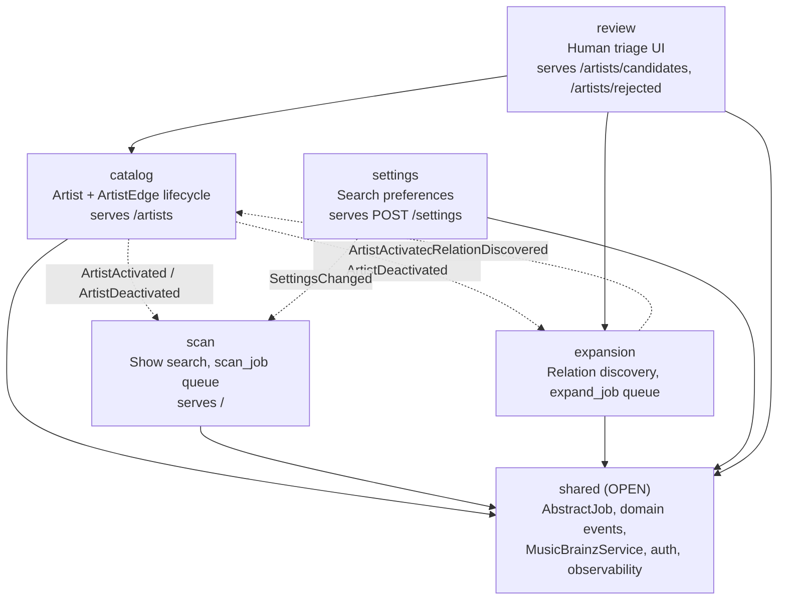
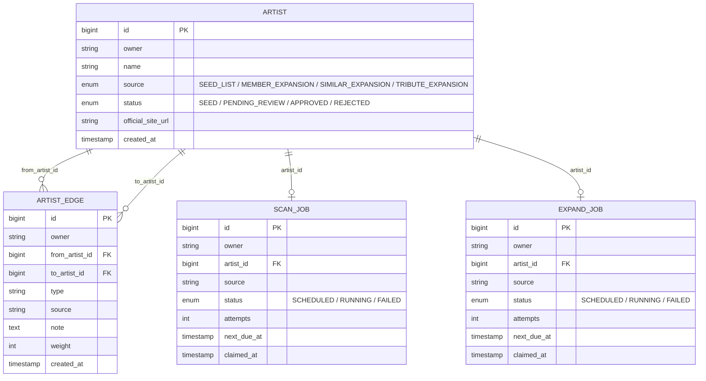
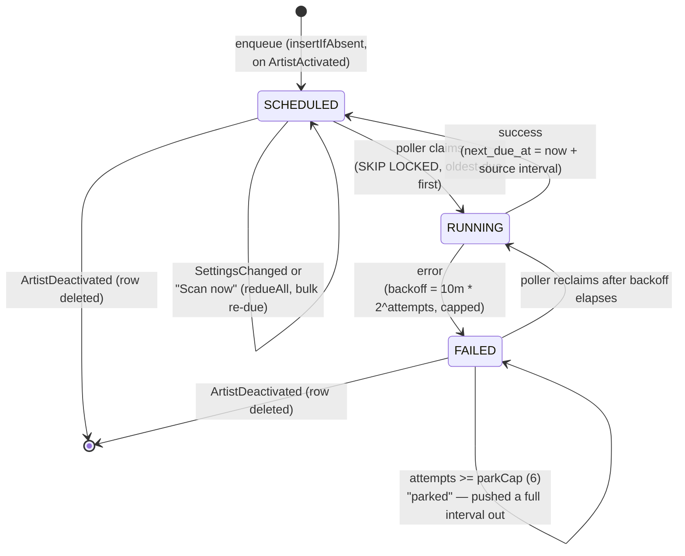
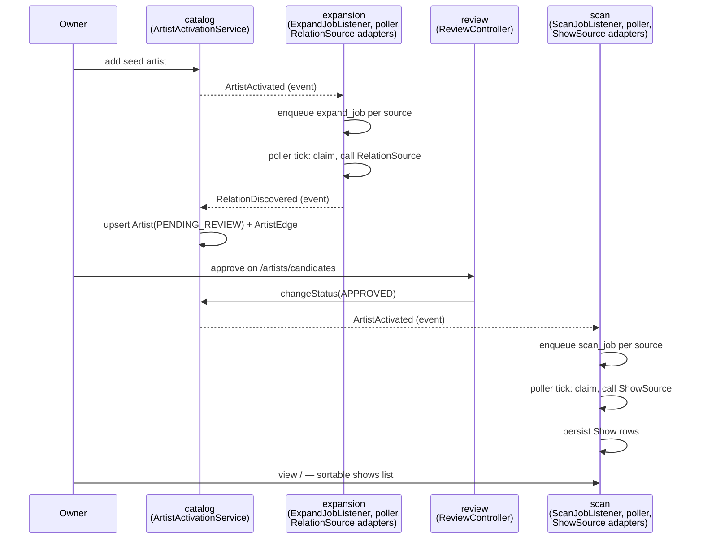
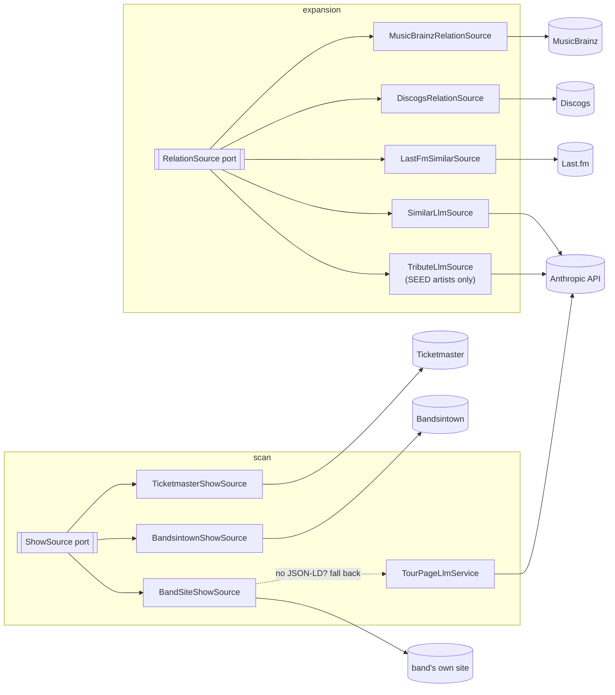

# Architecture Introduction

A guided tour of how Setlist Scout is put together today. The [ADRs](adr/README.md)
explain *why* each piece exists; this document explains *how the pieces fit together
right now*. Start here, then follow the ADR links inline when you want the backstory
on a particular decision.

Setlist Scout expands a seed list of artists (members, side projects, taste-alike
acts, tribute bands) and searches for their upcoming shows near a saved location.
Two independent, event-driven pipelines do the work — one grows the artist list,
the other finds shows for whoever's on it — connected by a human review gate in
the middle.

## 1. Modules

The app is a single Spring Boot service, but internally it's a
[Spring Modulith](https://spring.io/projects/spring-modulith) with enforced
package boundaries ([ADR-0021](adr/0021-adopt-spring-modulith-with-enforced-boundaries.md)).
Module boundaries are just top-level packages under `com.robsartin.setlistscout`
— no annotation needed to be a closed module, only `shared` is marked `OPEN`.
`ModularityTests` (`ApplicationModules.of(...).verify()`) fails the build if a
closed module reaches into another module's internals.

Dashed arrows are event edges — modules never call each other's services directly
to cross a boundary, they publish a domain event and let a listener in the other
module react ([ADR-0022](adr/0022-event-driven-inter-module-communication.md)).
The only solid cross-module arrows are `review`, which reads `catalog` and
`expansion` repositories directly because it's a UI over their data rather than
an independent domain, and the universal dependency on `shared` for the job
base class, the event records, and cross-cutting concerns (auth, correlation IDs).

## 2. Domain model

`artist (owner, name)` is unique and comparisons are case- **and**
punctuation-sensitive — always go through `catalog.ArtistNameNormalizer` /
`ArtistNameMatcher`, never hand-roll a comparison (an ASCII-stripping regex
collapses every non-Latin name to the same empty key).

`ArtistEdge` ([ADR context in `docs/explorations/2026-08-14-artist-graph-model.md`](explorations/2026-08-14-artist-graph-model.md))
deliberately allows multiple edges for the same `(from, to, type)` pair when
asserted by different sources — that's corroboration, not duplication, and it
replaced an earlier one-hop `discovered_via`/`source`/`note` design that lived
directly on `Artist`.

Two more tables round out the schema but aren't FK-linked to `Artist` — they
match by owner and name/string rather than by id: `show_event` (found shows,
unique per `owner, artistName, eventDateTime, venueName`) and
`search_settings` (one row per owner: postal code, radius, months-ahead window).

`scan_job` and `expand_job` share their column shape via `shared.AbstractJob`
(`@MappedSuperclass`) — same lifecycle, same poller mechanics, one entity per
module because they're drained by different pollers on different intervals.

Flyway is at **V12** as of this writing. `ddl-auto: validate` is on — every
schema change needs a migration *and* a matching entity mapping, or the app
won't boot ([ADR-0020](adr/0020-flyway-schema-migrations.md)). Migration
filenames sort wrong lexically (`V10` before `V9`) — always `sort -V`, never
`ls | sort`.

## 3. The job engine

There's no whole-fleet scheduled batch. Instead, every active artist gets its
own durable `(owner, artist, source)` job row, and two pollers drain whatever's
due ([ADR-0023](adr/0023-per-unit-event-driven-scan-work-model.md)):

Mechanics worth knowing before you touch this code:

- **Enqueue** is a native `INSERT ... ON CONFLICT (owner, artist_id, source) DO
  NOTHING` (`insertIfAbsent`) — not `existsBy` + `save`, which would poison the
  listener's transaction on a constraint race.
- **Claim** is a native `UPDATE ... WHERE id IN (SELECT ... FOR UPDATE SKIP
  LOCKED) RETURNING *`, so multiple poller instances never double-claim.
  Claimed work runs *outside* a transaction (adapter HTTP calls can be slow);
  each result gets its own short save afterward.
- **Re-due** bumps an optimistic-lock `version` column, so an in-flight
  poller's stale write to an already-re-dued row fails loudly
  (`OptimisticLockingFailureException`) and is dropped rather than silently
  overwriting the re-due.
- **Backfill** runs on every boot (`ScanJobBackfill`/`ExpandJobBackfill`) to
  idempotently enqueue jobs for artists activated before the job tables
  existed, or before a source was added — jittered so a redeploy doesn't
  stampede every job at once.
- Pollers are off by default (`setlistscout.scan-poller-enabled` /
  `expand-poller-enabled`) and tick on `setlistscout.scan-tick-ms` (default
  90s).

## 4. Domain events

Four event records live in `shared/events/`, delivered via
`@ApplicationModuleListener` (async, fires **after** the publishing
transaction commits, backed by Modulith's own durable `event_publication`
table):

| Event | Published by | Consumed by |
|---|---|---|
| `ArtistActivated` | `catalog.ArtistActivationService` | `scan.ScanJobListener`, `expansion.ExpandJobListener` — each enqueues a job per source |
| `ArtistDeactivated` | `catalog.ArtistActivationService` | both `*JobListener`s — delete that artist's job rows |
| `SettingsChanged` | `settings` module | `scan.ScanJobListener` only — re-dues all scan jobs (expansion isn't location-sensitive) |
| `RelationDiscovered` | `expansion.ExpandUnitRunner` | `catalog.RelationDiscoveredListener` — upserts a `PENDING_REVIEW` `Artist` and an `ArtistEdge`, deduped by name across any existing status including `REJECTED` |

**A rule that has already caused two production bugs**
([ADR-0024](adr/0024-event-and-durable-write-invariant.md)): an event
published with no committing transaction around it is silently dropped, and
listener writes must be `INSERT ... ON CONFLICT DO NOTHING`, never
`existsBy` + `save` + catch — a constraint race there poisons the whole
listener transaction.

## 5. End to end: seed to show

The two pipelines connect through the review gate. This is the full loop the
app exists to run:

Nothing in this chain runs synchronously with the request that triggers it —
"approve" just flips a status and publishes an event; the actual expansion or
show search happens on the next poller tick.

## 6. External sources: ports and adapters

Both pipelines talk to the outside world through a small module-owned
interface, never directly from a poller or controller
([ADR-0001](adr/0001-member-lineup-expansion-sources.md),
[0002](adr/0002-similar-artist-expansion-sources.md),
[0003](adr/0003-show-search-sources.md),
[0017](adr/0017-tribute-band-expansion-sources.md),
[0019](adr/0019-band-site-tour-scraping.md)):

Every adapter is `@Order`ed and swallows its own failures — a source erroring
out degrades to an empty result rather than failing the whole scan/expand
cycle for that artist. The three Anthropic call sites are plain `RestClient`
calls (no SDK dependency) against `/v1/messages`, each with a package-private
`baseUrl` constructor as a test seam for stubbing.

## 7. Web layer

Five page templates, all extending the shared `fragments/layout.html` shell
(nav: Shows / Artists / Candidates badge / Rejected / Settings):

| Route | Controller | Template |
|---|---|---|
| `GET /` | `scan.ShowController` | `shows.html` |
| `GET /artists` | `catalog.ArtistController` | `artists.html` |
| `GET /artists/candidates` | `review.ReviewController` | `candidates.html` |
| `GET /artists/rejected` | `review.ReviewController` | `rejected.html` |
| `GET /artists/{id}/graph` | `catalog.ArtistController` | `artist-graph.html` (debug tool: incoming/outgoing edges + 2-hop reachable set) |

`review.NavModelAdvice` is a `@ControllerAdvice` that injects the pending-review
count into every page's model, which is why the nav badge stays live without
each controller wiring it by hand.

**htmx** is vendored locally (`static/js/htmx.min.js`, no CDN). Server side,
every action checks the `HX-Request` header: present → return a named
Thymeleaf fragment (e.g. `"candidates :: rowDone"`); absent → full-page
`redirect:`. The recurring gotcha: `hx-get="@{/x}"` on a plain HTML attribute
ships the literal string `@{/x}` — Thymeleaf only resolves `@{...}` inside a
`th:*` attribute, so it has to be `th:hx-get`.

Focus is managed server-side: because every action swaps a whole region with
`outerHTML`, the focused element is destroyed and focus would drop to `<body>`.
`review.ActionOutcome` picks exactly one element per response — the next row's
same-decision button in the acted row's own relation group (so clearing a
group's last row lands on that group's own anchor, not the next group's —
intended, not an oversight), the current group's anchor, or nothing when the
trigger itself survives — and the template marks it `autofocus`, which htmx
honours in swapped-in content. The app deliberately ships **no custom
JavaScript**. The same response carries an `hx-swap-oob="innerHTML"` update for
`#sr-status`, the one permanent `role="status"` region (in the layout, outside
every swap target) — `innerHTML` is load-bearing, not stylistic, since htmx's
default `hx-swap-oob="true"` replaces the node instead and drops `role`/
`aria-live` to null, silently losing every announcement after the first;
`CandidateActionsTest` pins the exact string.

**Auth**: Google OAuth2/OIDC via a custom `OidcUserService` that checks the
verified email against an allow-list *during the OIDC exchange*, before a
session exists — deliberately hooked on `oidcUserService` rather than a plain
`OAuth2UserService`, which Spring Security skips whenever an `id_token` is
present ([ADR-0009](adr/0009-google-oauth-single-user.md)).

## 8. Tests

- **Unit tests** — plain JUnit, no Spring context (`ArtistNameNormalizerTest`,
  `GeoDistanceTest`, `CandidateGroupsTest`).
- **`ModularityTests`** — the one structural test enforcing module boundaries.
- **Real-path Testcontainers integration tests** — `JobEnqueueFlowTest`,
  `RelationDiscoveredFlowTest`, `ScanJobListenerTest`, `PollerFlowTest`, etc.
  Each declares its own `@Container PostgreSQLContainer` (deliberately not
  shared across test classes — avoids Hikari-pool contention). These drive the
  *actual* production publisher and assert the persisted effect.
- **Migration tests** — verify Flyway migrations against realistic
  pre-populated data.
- **Web render / wiring tests** — MockMvc-sliced page-render checks, service
  bean wiring, poller `@ConditionalOnProperty` gating, full-context boot smoke
  test.

One deliberate deviation worth knowing before you write a new event test:
Spring Modulith's `Scenario` test helper is **not used here**. It wraps an
event publish in its own transaction, which stays green even when the real
production publish site isn't inside a committing transaction — exactly the
bug ADR-0024 exists to prevent. That class of test was retired after it
produced a false green in production; every event flow gets a real-path
Testcontainers test instead.

## Where to go next

- [`docs/adr/`](adr/README.md) — why each major decision was made, in order.
- [`docs/explorations/2026-08-14-artist-graph-model.md`](explorations/2026-08-14-artist-graph-model.md) — the reasoning behind the `artist_edge` graph model.
- [`docs/superpowers/specs/2026-08-12-modulith-event-driven-redesign.md`](superpowers/specs/2026-08-12-modulith-event-driven-redesign.md) — the design spec for the module/event/job-engine shape described above.
- [`CLAUDE.md`](../CLAUDE.md) — the build gate, invariants that have caused production bugs, and gotchas that have wasted real time. Read it before touching anything.
